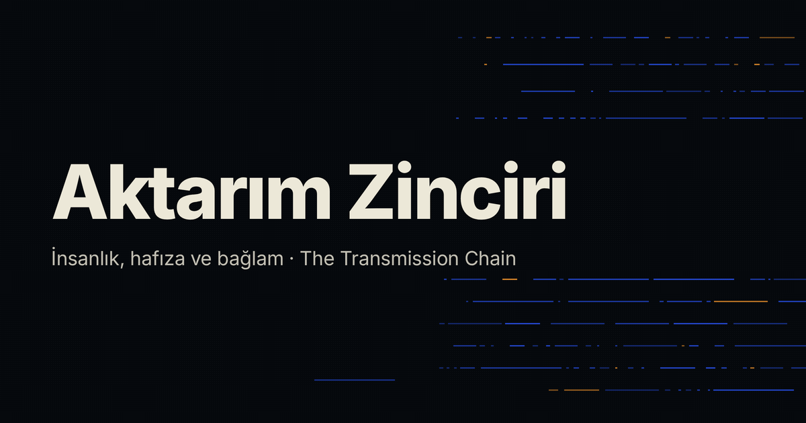

<p align="center">
  
</p>

<h1 align="center">Bilginin Taşınma Yolculuğu</h1>

<p align="center">
  <strong>Aktarım Zinciri · The Transmission Chain</strong><br/>
  <em>(önceki adı: Bilginin Ziplenmesi / The Zipping of Knowledge)</em>
</p>

<p align="center">
  <a href="https://ahmet3ddd.github.io/bilginin-tasinma-yolculugu/">
    
  </a>
</p>

<p align="center">
  
  
  
  
  
</p>

<p align="center">
  İnsanlığın bilgiyi kuşaklar arasında nasıl paketlediğini, bağlamı nasıl koruduğunu ve
  neyi kaybettiğini araştıran etkileşimli çalışma. Türkçe ve İngilizce, tek dosya.
</p>

<p align="center">
  <em>An interactive study of how humanity packs knowledge across generations, how context
  is preserved, and what gets lost. Turkish and English, in a single file.</em>
</p>

---

## Künye / Credits

**Yazar:** Ahmet Çandöken · ORCID [0009-0001-5197-7888](https://orcid.org/0009-0001-5197-7888) (`ahmetoff` · [github.com/ahmet3ddd](https://github.com/ahmet3ddd))
**Sürüm:** v5.3 · **Veri kesim tarihi:** 23 Ağustos 2026
**Lisans:** metin ve veri [CC BY 4.0](LICENSE-CC-BY-4.0.txt) · kod [MIT](LICENSE)

**Yazar bu alanların hiçbirinde akademik uzman değildir.** Bu çalışma bir araştırma katkısı
değil, kaynaklarıyla birlikte sunulan bir **sentez ve öğretim aracıdır.**

**Bu çalışma insan hakemliğinden geçmemiştir.** Uygulanan denetim, altı ayrı uzmanlık
çerçevesinden **yapay zekâ modelleriyle yürütülen çekişmeli eleştiridir** ve hakemliğin
yerine geçmez. Metinlerin yazımı, kod, kaynak taraması ve öncül araştırması da yapay zekâ
desteğiyle yapılmıştır. Kaynakların tamamı açılıp doğrulanmış, doğrulanamayanlar açıkça
işaretlenmiştir. **Sorumluluk yazara aittir.**

Kullanım koşulları, sorumluluk reddi ve gizlilik beyanı çalışmanın içindedir:
**Yöntem ve Sınırlar → Kullanım koşulları.** Yeniden yayımlayan herkesin, çalışmanın
hakemlikten geçmediği ve yapay zekâ desteğiyle üretildiği beyanını da birlikte taşıması
beklenir.

## Bu çalışma nedir? / What is this?

**Bir keşif değil, bir sentezdir.** Buradaki fikirlerin çoğu yedi ayrı literatürde —
örtük bilgi (Polanyi, Collins), kültürel evrim modelleri (Henrich, Mesoudi), dijital
koruma (OAIS/ISO 14721), altyapı ve bakım çalışmaları (Latour, Star), sıkıştırma
deneyleri (Kirby), 10.000 yıl mühendisliği (WIPP, Rosetta, GitHub Tech Tree) ve yazı
sistemlerinin ölümü ile dil tehlikesi (Houston/Baines/Cooper, Krauss, UNESCO) — daha önce
söylendi. Bu çalışmanın işi, **birbirini okumayan bu yedi alanı tek bir çalıştırılabilir
zincirde birleştirmek**tir. Kimin neyi önce söylediği, **Yöntem → Öncüller** bölümünde tek
tek adlandırılır.

## Tez / The argument

İnsan geçmişin tamamını değil, semboller ve prosedürler içinde sıkıştırılmış paketlerini
devralır. Açma anahtarı kaybolduğunda sonuç kalabilir; bilgi yeniden üretilemez hâle
gelebilir. Çalışma bu iddiayı **altı halkalı bir aktarım zinciri** üzerinden kurar:

| Halka | Link | Ne demek |
|---|---|---|
| Paket | Packet | Yazılı tarif, şema, patent, standart |
| Çözücü | Decoder | Onu okuyup uygulayabilen insanlar ve ortak diller |
| Bağlam | Context | Neden çalıştığı, hangi sınırlarla, hangi hata tarihiyle |
| Örtük bilgi | Tacit | Yazıya hiç geçmeyen el becerisi ve atölye sırası |
| Aparat | Apparatus | Onu yapan ve okuyan makineler |
| Bakım | Maintenance | Kopyalama ve öğretme emeğinin her kuşakta yenilenmesi |

> **En sağlam sonuç:** İlerleme yalnız arşivin büyümesi değil; kayıt, insan, eğitim, araç,
> kurum ve eleştiri ağının birlikte yaşayabilmesidir.

## Ne var içinde? / What's in it

| Bölüm | Section | İçerik |
|---|---|---|
| Genel Bakış | Overview | Tez, aktarım zinciri, vaka önizlemeleri |
| Model Laboratuvarı | Model Lab | Kuşak simülasyonu, tarihsel ön ayarlar, eğri dondurup karşılaştırma |
| 100.000 Yıl | 100,000 Years | 38 tarihli kanıt kaydı, model endeksleri, kanıt şeritleri, eğrinin kendi sınırı |
| Kayıp Vakaları | Loss Cases | Kayıp vakaları, efsane düzeltmeleri, dijital karanlık çağ, yapay zekâ |
| Zincir Haritaları | Chain Maps | **32 nesnenin zincir haritası** (modern dünya · Osmanlı · Roma), 32×6 model sınavı, Zincir Sondası |
| Yöntem ve Sınırlar | Method & Limits | Sözlük, formüller, kayıp taksonomisi, künye, öncüller, **kullanım koşulları**, düzeltme günlüğü |
| Kaynakça | Sources | 75 kaynak, 7 grup; haritaların içinde ayrıca 160+ tarihli kaynak kaydı |

Her kanıt kaydı ve her vaka kartı, *ne gösterdiği* kadar *ne göstermediğini* de açıkça yazar.

## Veri / Data

Çalışmanın ampirik katmanı `index.html` içinden çıkarılıp ayrı, makine okunur dosyalar
hâlinde `data/` klasöründe yayımlanmıştır — CC BY 4.0.

| Dosya | Satır | Gözlem birimi |
|---|---|---|
| `data/events.csv` | 255 | bir nesnenin zincirinde tarihli, kaynaklı bir olay |
| `data/objects.csv` | 32 | bir nesne |
| `data/evidence.csv` | 38 | tarihli bir kanıt kaydı |
| `data/model-coverage.csv` | 192 | 32 × 6 matrisin bir hücresi |
| `data/sources.csv` | 275 | benzersiz bir kaynak adresi |
| `data/corpus.json` | — | kayıpsız iki dilli dışa aktarım + model parametreleri |

Kullanmadan önce **`data/CODEBOOK.md`** (İngilizce) ya da **`data/KOD-KITAPCIGI.md`**
(Türkçe) okunmalıdır: halkaların işletim tanımları, kodlama kuralları ve sınırlar oradadır.
İki sınır özellikle önemlidir — kodlama **tek ve körlenmemiş bir kodlayıcıya** aittir ve
nesne seçimi **iki ayrı yönde yanlıdır**; bu yüzden korpustan taban oran hesaplanamaz.

## Bu çalışmanın kendine koyduğu kurallar

1. **Uydurma sayı yok.** Model parametreleri kanıttan ölçülmez, *varsayılır* — ve bu her
   ekranda yazılıdır.
2. **Vaka merceği tek sabit kuralla çalışır.** Her nesne için **aynı** kural; nesneye özel
   ayar yoktur.
3. **Model kendi sınavına girer.** 32×6'lık matris, modelin kaç vakada kırılgan halkayı
   yalıtabildiğini sayar. Sonuç modelin aleyhine: 10 tam, 16 kısmî, 6 hiç.
4. **Zincir Sondası internete çıkmaz.** Motor yalnız kullanıcının cevaplarını profile
   çevirir ve "bilinmiyor"u asla "zayıf" saymaz.
5. **Eğriye vaka uydurulmaz.** Bütün tanıklar kanıt şeritlerine işlendi.
6. **Öncüller adlandırılır.** *"Buradaki hiçbir fikir ilk kez söylenmiyor; bu sayfanın işi,
   ilk kez yan yana söylemek."*
7. **Hiçbir nesne ayrıcalıklı değil.** Bir dil de, bir su kemeri de, bir kurşun kalem de
   aynı altı halkayla ve aynı kuralla ölçülür.
8. **Nasıl yapıldığı gizlenmez.** Yazar adı, uzmanlık beyanı ve yapay zekâ katkısının
   kapsamı künyede açıkça yazılıdır.
9. **Model, aleyhine çıktığında düzeltilir, gizlenmez.** v5.3'te vaka merceğinin aparat ve
   bakım vakalarını olduğundan sağlıklı gösterdiği bulundu ve kural kaldırıldı — gerekçesi
   düzeltme günlüğünde sayılarıyla yazılıdır.

## v5.3 · Ad, lisans, kullanım koşulları ve modelin işaret düzeltmesi

- **Yazar adı, lisans ayrımı ve kullanım koşulları** eklendi; "uzman incelemesi" ifadesi
  her yerden kaldırılıp yerine mekanizma yazıldı.
- **Vaka merceğindeki işaret hatası düzeltildi.** Bu motorda kısa arşiv yarı ömrü yeniden
  kurulabilirliği *yükseltiyor* (zirve h≈12); eski kural, en ince halkası aparat ya da
  bakım olan nesnelere h=10 veriyordu ve onları çalışmanın **en sağlıklı** eğrileri
  gibi gösteriyordu. Artık yarı ömür hiçbir vakada düşürülmüyor: aparat ve bakım, örtük
  bilgi gibi, modelin körlüğü **görünür kalsın diye** sağlıklı bırakılıyor.
- **"Söyleyemez" listesine iki madde eklendi:** paketleme kazancının modelde hiçbir bağlam
  maliyeti olmadığı, ve dayanıklı arşiv sonucunun bir koruma politikası önerisi olarak
  okunamayacağı.
- **Örneklem yanlılığı** canlı metne yazıldı — hem Kayıp Vakaları'nın hem Zincir
  Haritaları'nın girişine, tek kodlayıcı sınırı dahil.
- **Ubıhça kaydı düzeltildi:** ünsüz ve ünlü sayıları artık çözümlemeleriyle birlikte
  aralık olarak veriliyor, ve Hewitt'in 1974 kayıtları ile CNRS Pangloss derlemi iki ayrı
  koleksiyon olarak ayrıldı.
- **Yazı tipi gömüldü:** sayfa artık hiçbir dış sunucuya istek yapmıyor.

## Teknik / Technical

- **Tek dosya.** `index.html` kendi kendine yeter: CSS, JavaScript, yazı tipi, favicon ve
  bütün veri gömülüdür.
- **Hiçbir dış istek yok.** Ne yazı tipi, ne betik, ne analitik, ne çerez. Bu, çalışmanın
  gizlilik beyanının denetlenebilir karşılığıdır.
- **Bağımlılık ve derleme adımı yok.** Framework yok, npm yok, build yok.
- Grafikler elle üretilen SVG'dir; ipucu, erişilebilir veri tablosu ve SVG/PNG indirme destekler.
- Karanlık/açık tema, `prefers-color-scheme` ve `prefers-reduced-motion` desteği, yazdırma düzeni.
- Hash yönlendirme (`#/görünüm`), `<iframe sandbox>` içinde de çalışır.
- Dosya boyutu: ~880 KB.

### Yerelde çalıştırma

```bash
git clone https://github.com/ahmet3ddd/bilginin-tasinma-yolculugu
cd bilginin-tasinma-yolculugu
python3 -m http.server 8000   # ya da index.html'i doğrudan tarayıcıda açın
```

## Yayına alma ve güncelleme / Publishing and updating

Depo **yayındadır**: <https://ahmet3ddd.github.io/bilginin-tasinma-yolculugu/>

`index.html` değiştiğinde site kendiliğinden güncellenmez — `.github/workflows/pages.yml`
yalnız elle tetiklenir. Yayınlamak için: **Actions → Deploy to Pages → Run workflow.**
Otomatikleştirmek isterseniz `pages.yml` içindeki `push:` bloğunun yorumunu kaldırın.

## Atıf / Citation

Makine okunur künye `CITATION.cff` dosyasındadır.

> Çandöken, Ahmet (2026). *Aktarım Zinciri / The Transmission Chain*, v5.3.
> https://ahmet3ddd.github.io/bilginin-tasinma-yolculugu/ — CC BY 4.0

## Belgeler / Documents

Aşağıdaki belgelerin tamamı **yapay zekâ modelleriyle yürütülen çekişmeli eleştirinin**
çıktısıdır; her birinin başında bu beyan yazılıdır. İnsan hakemliği değildir.

| Dosya | İçerik |
|---|---|
| [`docs/01-cekismeli-elestiri-karar.md`](docs/01-cekismeli-elestiri-karar.md) | Altı uzmanlık çerçevesinden eleştirinin kararı |
| [`docs/02-inceleme-paketi.md`](docs/02-inceleme-paketi.md) | Eleştiriye verilen tam paket |
| [`docs/03-revizyon-gunlugu.md`](docs/03-revizyon-gunlugu.md) | Sürüm sürüm ne değişti |
| [`docs/04-revizyon-felsefesi.md`](docs/04-revizyon-felsefesi.md) | Düzeltme kararlarının ölçütü |
| [`docs/05-onculler-ve-oncelik.md`](docs/05-onculler-ve-oncelik.md) | **Öncüller taraması:** yedi literatür, zorunlu atıf listesi, özgünlük haritası |

## Lisans / License

İki lisans, iki tür iş için — ayrıntı [`LICENSE`](LICENSE) dosyasındadır.

- **Metin ve veri:** [CC BY 4.0](LICENSE-CC-BY-4.0.txt)
- **Kod:** MIT
- **Inter yazı tipi:** © 2016 The Inter Project Authors, [SIL OFL 1.1](LICENSE-Inter-OFL.txt)
- **Alıntılanan birincil kaynaklar** kendi hak sahiplerine tabidir ve çalışma içindeki
  bağlantılardan doğrudan erişilir.
